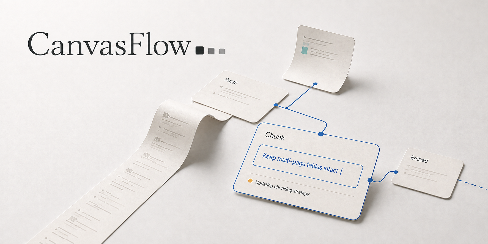
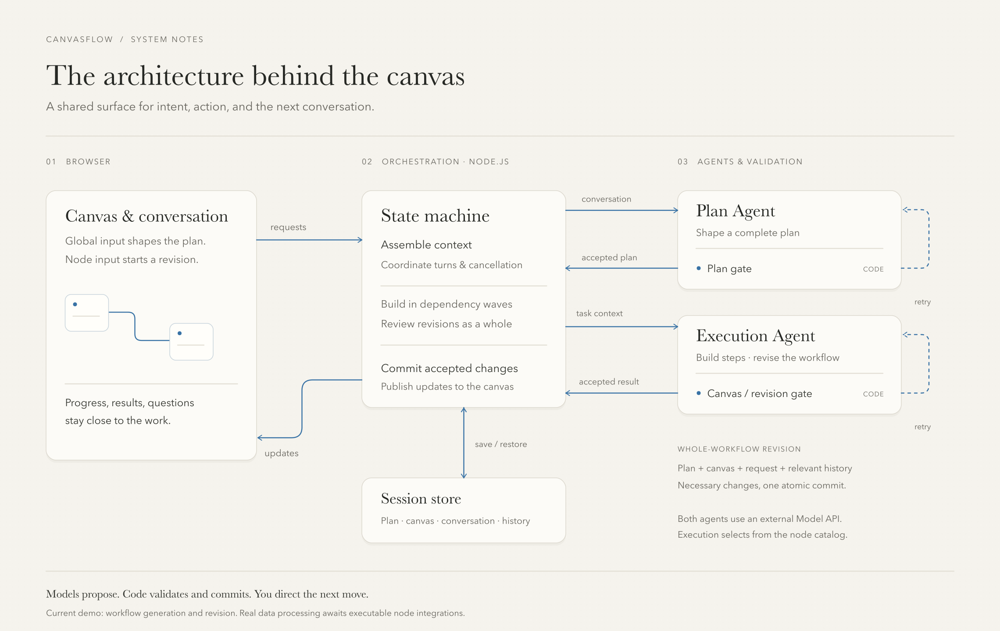

**English** · [简体中文](README.zh-CN.md)



# CanvasFlow

**A shared canvas for building data workflows with AI.**

Describe what your data needs to become. As the agent builds the workflow, its progress takes shape on the canvas. Open a node to ask a question or request a change, then follow how the workflow responds.

[Get started](#get-started) · [Why a canvas](#why-a-canvas) · [Under the canvas](#under-the-canvas) · [Development guide](docs/development.md)

CanvasFlow starts with the kind of visual workflow building found in tools such as Dify and n8n. Its goal is to help people turn raw documents and data into material AI can use, through parsing, cleaning, chunking, and structuring. The canvas interaction and agent architecture are designed around that work.

> **Current stage:** a working interaction and architecture demo. AI generates and revises plans, node configurations, and connections. Uploading and processing real data will require future integrations with executable node capabilities; the demo does not run OCR, embeddings, or database writes. The banner is concept artwork, not an application screenshot.

## Why a canvas

A workflow already has structure: what happens first, where paths branch, and what depends on what. CanvasFlow brings the questions, responses, confirmations, and edits of a chat interface into the nodes and connections they concern.

Start with the whole picture, then step into a node. Your request, its progress, and the response stay together. Each exchange informs the next round of work, and the canvas continues to change with your participation.

**The canvas makes collaboration visible as it happens.** Where is the agent working? What needs your input? What changed because of your last request? These should be things you can understand from the workspace. We are exploring how the agent loop—request, action, validation, feedback, and revision—can become an interaction you can see and participate in.

If a chat box is a terminal, a canvas could be a desktop for working with AI. Data processing gives this interaction concrete objects, dependencies, and goals.

**Respect for your attention, and for your judgment.** When information appears, how a card opens, and whether a change is understandable are part of the product. The aim is to help you understand and direct the next step.

## Working together

### Start with a goal

Describe what you want in the bottom input. The Plan Agent organizes the goal, the steps, and any questions that need answering. Add context, review the plan, and start building. Nodes and connections appear progressively on the canvas.

### Continue inside a node

Open a card to inspect its configuration and connections, then make a request in its local input. Progress, results, and explanations stay in that node. The bottom input always addresses the whole workflow; selecting a node does not silently change its scope.

### Ask locally. Revise with the whole workflow in view.

Imagine a five-step workflow. In step three, you ask to store monetary amounts as integer minor units. The aggregation in step five may need to change too.

A revision includes the full plan, the latest canvas, and relevant history. The execution agent reviews the workflow and submits the necessary changes. The system checks the complete candidate canvas before applying it atomically. Step three is where the conversation starts; the operation is not a rerun of step three alone.

### Pick up where you left off

Manage workflow sessions in the sidebar: create, rename, switch, delete, and restore. Committed plans and canvases are saved locally and survive a refresh. Expand details when needed, zoom or reset the canvas, and switch between light and dark appearance in sidebar settings.

## Where things stand

- **Available now:** multi-turn planning, progressive construction, whole-workflow revisions initiated inside nodes, local sessions, parameter configuration, cancellation and failure feedback, and light and dark appearance.
- **Still being explored:** a persistent Goal panel beyond the current plan card, and the interaction rhythm of generation, branching, and expanding long content. Standalone motion studies are not necessarily part of the application.
- **Future capability:** connect executable nodes so users can upload data and run the workflow to prepare it for AI use. This is not implemented yet.
- **Outside the current demo:** cross-device sync, multi-user collaboration, and accounts for a public hosted service.

## Get started

You need **Node.js 22.9 or later** and an OpenAI-compatible model endpoint with tool calling. Compatibility depends on the provider's response format and tool-calling behavior.

```bash
git clone https://github.com/Bai-009/canvas-first-workflow.git
cd canvas-first-workflow
npm ci
cp .env.example .env
```

Set these values in `.env`. Include the API prefix, such as `/v1`, in the base URL; the application appends `/chat/completions`:

```dotenv
MODEL_BASE_URL=https://your-provider.example/v1
MODEL_API_KEY=your-api-key
MODEL_NAME=your-model-name
```

```bash
npm run web
```

Open **[127.0.0.1:5174](http://127.0.0.1:5174/)**. Access the application through the server rather than opening its source HTML directly. The current application interface is in Chinese.

Try a request like this:

> Build a workflow for scanned PDFs: extract the text, split it into chunks, generate embeddings, and store them in a vector database for retrieval.

This generates a workflow configuration; it does not read or process actual PDFs. Model calls send your input and relevant workflow context to the model service you configure.

**To explore the interaction without configuring a model:** run `npm run build`, then open `dist/prototype/index.html` in a browser. This separate offline demo uses recorded plans and a hand-authored execution canvas.

## Under the canvas



The frontend and backend use TypeScript, checked separately for browser and Node.js environments. The browser handles the canvas and interaction. The Node.js service handles model calls, state, validation, and local storage. They communicate over HTTP and server-sent events.

The architecture follows the collaboration loop. Planning captures intent; execution builds and revises the canvas; the state machine manages context and commits; validators return detectable problems to the agent. Progress, results, and requests for user input return to the canvas to inform the next exchange.

| Role | Responsibility |
| --- | --- |
| Plan Agent | Organize requirements into a plan, describe each data transformation, and ask for missing information |
| Execution Agent | Build from the node catalog; submit targeted revisions with the whole workflow in context |
| State machine | Coordinate construction and revision, assemble context, and manage execution ownership, cancellation, and commits |
| Validators (Gates) | Check plan and canvas contracts, node configuration, connections, and coarse data shapes |

Models propose; code decides what can become part of the current canvas. Initial construction proceeds in dependency waves. A revision is checked as a complete candidate and committed atomically. Failure or cancellation does not leave a partially applied revision.

These checks catch some structural errors. **They do not prove business semantics are correct.** Consistent field units, for example, still require model reasoning and human review.

Sessions live in `.sessions/`, run records in `.runs/`, and unsent drafts in the current browser. Restarting the server preserves committed results; unfinished tasks are marked interrupted and do not automatically call the model again. Model credentials remain in the server-side `.env`. See the [development guide](docs/development.md) for details.

## Explore further

The design notes and historical run records below are currently in Chinese.

| Topic | Start here |
| --- | --- |
| Architecture and tradeoffs | [Architecture](docs/架构.md) · [Tradeoffs](docs/取舍.md) |
| Planning and execution | [Plan contract](docs/plan-契约.md) · [Executor](docs/执行者.md) · [State machine](docs/状态机.md) |
| Observed model behavior | [Observations](docs/观察.md) · [Cross-step revision trace](fixtures/observed/run14-节点整图修订/README.md) |
| Interaction direction | [Interaction design plan](docs/交互秩序改造计划.md) |
| Running and developing | [Development guide (English)](docs/development.md) · [TypeScript migration](docs/TypeScript迁移.md) |

Feedback is welcome in [Issues](https://github.com/Bai-009/canvas-first-workflow/issues). If a moment leaves you unsure where to look or what changed, tell us what you were trying to do, what happened, and what you expected. Those concrete experiences are valuable evidence for this experiment.
