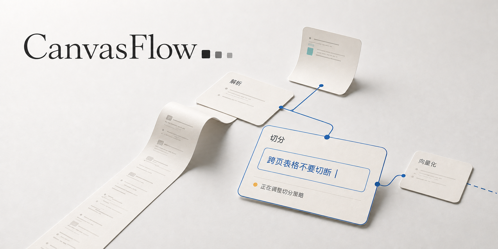
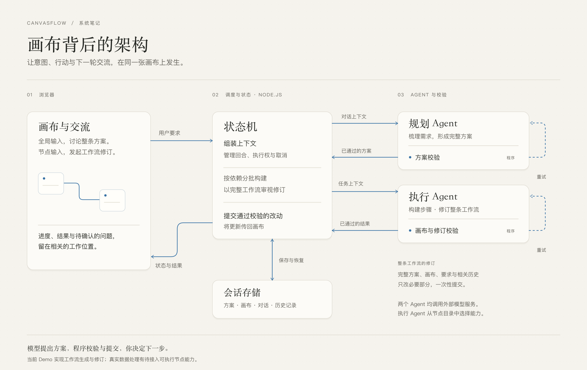

[English](README.md) · **简体中文**



# CanvasFlow

**与 AI 共同构建数据工作流的画布。**

描述你希望数据变成什么。Agent 构建工作流的过程，会逐步呈现在画布上。进入节点提问或提出修改，再看这次交流如何改变工作流。

[开始体验](#开始体验) · [交互理念](#为什么是画布) · [运行机制](#画布背后) · [开发指南](docs/开发指南.md)

项目从 Dify、n8n 这类可视化工作流的使用场景出发，目标是帮助用户建立数据处理链路：将原始文档和数据解析、清洗、切分、结构化，准备成适合 AI 使用的数据。围绕这个目标，CanvasFlow 探索画布交互和 Agent 架构如何共同支持人与 AI 的协作。

> 当前已实现方案、节点配置与连线的真实 AI 生成和修订。上传并处理真实数据，需要未来接入相应的节点执行能力；现阶段不运行实际的 OCR、向量化或数据库写入。上方是表达交互方向的概念宣传图，实际界面请运行项目体验。

## 为什么是画布

工作流本来就有结构：哪些步骤先发生、哪里分支、什么依赖什么。CanvasFlow 把常规对话框里的提问、回应、确认和修改，放回相应的节点与连接上，让这份结构承担交流本身。

你可以先看全局，再进入一个节点。要求在哪里提出，处理状态与反馈就在哪里出现。一次回应进入下一轮，画布继续变化，用户也能继续介入。

**画布呈现的是协作的进行过程。** Agent 正在推进哪一步，哪里需要补充信息，刚才的要求改变了什么，都应当能够从画面中理解。我们希望把 Agent 接收要求、行动、校验、反馈、再次调整的循环，转化为用户可以看见并参与的交互。

如果对话框像终端，画布也许可以成为人与 AI 协作的桌面。数据处理给了这套交互具体的对象、依赖和目标。

**尊重用户的注意力，也尊重用户的判断。** 信息何时出现、展开一张卡片的节奏、一次修改能否被看懂，都是产品本身。我们希望用户能理解并决定下一步，而不是被迫适应 Agent 的表达方式。

## 在这里怎样协作

### 从一个目标开始

在底部描述你想完成的事。Plan Agent 整理目标、步骤和需要确认的问题；补充信息后，方案继续更新。确认方案并开始构建，节点和连线逐步出现在画布上。

### 在节点里继续交流

展开一张卡片，查看它的参数与连接，在卡片底部提出要求。处理状态、修改结果和相关说明留在这个节点里。底部输入框始终面向整条工作流，不因选中节点而悄悄更换作用对象。

### 从局部发起，对整体负责

假设一条工作流有五个步骤。你在第三步说“金额改成以分存储”，第五步的汇总也可能需要调整。

这次请求会带上完整计划、最新画布和相关历史。执行 Agent 审视整条工作流后提交必要的修改，系统检查完整候选画布，再一次性应用。这里的“修改第三步”是交流的起点，不是只重跑第三步。

### 留下来，下次接着做

左侧管理工作流会话，支持新建、重命名、切换、删除与恢复。已提交的方案和画布保存在本机，刷新后可以继续查看。长内容按需展开，画布支持缩放与复位，浅色和暗色外观在侧栏设置中切换。

## 当前边界

- **已经可以体验：** 多轮规划、逐步构建、节点内整图修订、本机会话保存、参数配置、停止与失败反馈、浅色与暗色外观。
- **仍在探索：** 右上角从方案卡走向持续的 Goal 面板，以及生成、分支、长内容展开时的交互节奏。独立动效原型不代表正式应用已采用。
- **后续能力方向：** 接入适合的真实节点能力，让用户上传数据并运行处理链路，得到适合 AI 使用的数据。这部分尚未实现。
- **不在当前 Demo 范围：** 跨设备同步、多人协作和面向公网的账户系统。

## 开始体验

需要 **Node.js 22.9 或更高版本**，以及支持工具调用的 OpenAI 兼容模型接口。模型是否适配仍取决于具体服务的响应格式与工具调用行为。

```bash
git clone https://github.com/Bai-009/canvas-first-workflow.git
cd canvas-first-workflow
npm ci
cp .env.example .env
```

在 `.env` 中填写模型配置。地址填写到 `/v1` 这一层，程序会追加 `/chat/completions`：

```dotenv
MODEL_BASE_URL=https://your-provider.example/v1
MODEL_API_KEY=your-api-key
MODEL_NAME=your-model-name
```

```bash
npm run web
```

打开 **[127.0.0.1:5174](http://127.0.0.1:5174/)**。请通过服务访问，不要直接打开源码中的 HTML。

可以从这个需求开始：

> 处理一批扫描版 PDF：先识别文字，再切分文本、向量化，最后存入向量数据库，供后续检索。

这里会生成处理链路的配置，不会读取和处理真实 PDF。模型调用会把你输入的内容及相关工作流上下文发送到配置的模型服务。

**只想看交互，无需模型配置：** 运行 `npm run build`，然后用浏览器打开 `dist/prototype/index.html`。这个离线演示使用已记录的方案和手写的执行画布，和实时应用分开维护。

## 画布背后



前端和后端都使用 TypeScript，分别按浏览器与 Node.js 环境检查。浏览器负责画布和交互，Node.js 服务负责模型调用、状态管理、校验与本地存储，通过 HTTP 和服务端事件流连接。

Agent 架构围绕这段协作过程分工：规划负责整体意图，构建与修订负责具体画布，状态机管理每一轮的上下文和提交，校验器把能够检查的问题退回给 Agent。阶段、结果和需要用户介入的事项再返回画布，成为下一次交流的依据。

| 角色 | 负责什么 |
| --- | --- |
| Plan Agent | 把需求整理成计划，明确数据在每一步如何变化，询问缺失的信息 |
| Execution Agent | 根据节点目录构建画布；修订时结合整图上下文提交必要的差量 |
| 状态机 | 编排构建与修订，组装上下文，管理执行权、停止与提交 |
| 校验器（Gate） | 检查计划与画布契约、节点配置、连接和粗粒度数据形态 |

模型提出方案，代码决定哪些结果可以进入当前画布。首次构建按依赖分批推进；节点修订先合成完整候选画布，检查通过后原子提交，失败或停止不会留下半份修订。

这些检查能拦住一部分结构错误，**不能证明业务语义一定正确**。例如字段单位是否一致，仍需要模型判断和用户审阅。

会话默认存放在 `.sessions/`，运行记录在 `.runs/`，未发送草稿保存在当前浏览器。服务重启后保留已提交结果，进行中的任务会标记为中断，不会自动再次调用模型。模型密钥留在服务端 `.env`。更多存储与开发说明见[开发指南](docs/开发指南.md)。

## 继续了解

| 想了解什么 | 从这里开始 |
| --- | --- |
| 架构和关键取舍 | [架构](docs/架构.md) · [取舍](docs/取舍.md) |
| 规划和执行如何协作 | [计划契约](docs/plan-契约.md) · [执行者](docs/执行者.md) · [状态机](docs/状态机.md) |
| 真模型实际表现 | [观察记录](docs/观察.md) · [跨步骤修订实录](fixtures/observed/run14-节点整图修订/README.md) |
| 交互方向与待办 | [交互秩序改造计划](docs/交互秩序改造计划.md) |
| 运行、测试和代码入口 | [开发指南](docs/开发指南.md) · [TypeScript 迁移记录](docs/TypeScript迁移.md) |

欢迎通过 [Issues](https://github.com/Bai-009/canvas-first-workflow/issues) 交流。如果某个瞬间让你失去方向，或某次修改让你无法判断发生了什么，请描述当时的目标、操作与预期。这些具体感受，是这个实验最需要的反馈。
