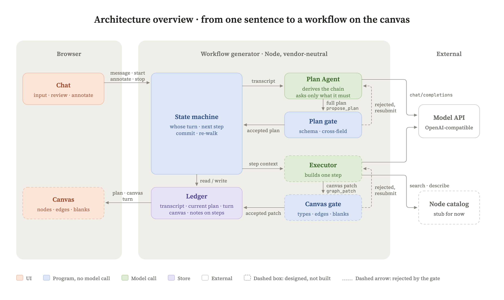

# 架构：整条环

问题只有一个：什么样的架构，才能让 AI 的输出变成生长中的工作流，而不是长在对话框里的东西。

这份文件是整条流程的权威描述。**改流程先改这份文件，再改代码；代码跟这份文件不一致，以这份文件为准，把代码改回来。** 每一节末尾标了现在做到哪儿；细节在 [状态机.md](状态机.md)、[执行者.md](执行者.md)、[词表.md](词表.md)，每一刀背后放弃了什么在 [取舍.md](取舍.md)。

## 五个角色

| 角色 | 管什么 | 不管什么 |
|---|---|---|
| **用户**（看守） | 打一句话；看画布；批注；按开始、按停；定空位 | 不看对话记录。画布就是全部 |
| **设计者**（Plan Agent） | 定这条链该完成什么、怎样才算完整：数据现在什么形态、最后什么形态、中间变几次；只问只在用户那边的事实 | 不选节点，不填参数，不看平台有什么 |
| **状态机**（调度） | 按方案分波递步、拼上下文、收执行者交回的、过闸门、进画布、发信号给画布、跑完换手给用户 | 不判对错 |
| **执行者**（Execution Agent） | 拿一步，在平台可用的节点里选、填、连，交回一份画布改动。**有选择权，没有创造权**：节点是我们定义的，它只能挑 | 不裁决自己做没做完 |
| **闸门**（Gate） | 唯一能让东西成为事实的口。方案闸门查设计者交的，画布闸门查执行者交的 | 只拦机器缺了转不动的、能确定为假的。语义对不对归模型和用户 |

一句话：设计者定「应该完成什么、怎样才算完整」；执行者按平台真实能力定「用什么、怎么做出来」；状态机把前者一步一步交给后者；闸门决定什么才能成为事实；用户在画布上看着它长，随手改。

## 整条环

### 第一段：你的话变成方案

1. 你打一句话。
2. 设计者读到整段对话记录，要么只说话（信息不够先问你，这是合法产出），要么调一次「提交方案」。方案的形状由契约定（[contracts/plan-proposal.schema.json](../contracts/plan-proposal.schema.json)）：目标、回读（原话 → 读成什么）、路线（每步：环节名、要什么结果、进来的形态、出去的形态、接在谁后面）、缺口（问题、缺了会怎样、影响哪几步、备选项）、能不能交给执行。
3. 方案闸门：契约文件加跨字段检查（编号不重、依赖存在、影响指向存在的步）。没过，错误写成人话原样退回，要求整份重交，最多再试三次。过了，当前方案换新，版本加一。程序一个字不替模型改。
4. 回合制：你发一句是一轮，模型跑完换回你；一轮在跑不收第二句，要插话先停。
5. 你补一句，设计者整份重推，不吐增量。编号沿用就是原地改，换编号就是重来；界面拿两版按编号算增量。
6. 缺口清了，或者你不想再答，都可以按开始。没答的缺口不挡执行，变成卡上的空位。

数据形态转变一次算一步：合同 PDF 那句话是四步（文件清单 → 文本 → 字段 → 库里的记录）。「每天定时」不转变形态，写进第一步的进来的形态里。

**现在**：有，真模型验过（`fixtures/observed/` run1–run8）。
行业叫法：tool calling；schema validation；revision；turn-based。

### 按开始：分波

状态机读方案里每步「接在谁后面」，分波：互不依赖的步算同一波，一起交给执行者；一波做完才开下一波。同一波的步看到的都是这波开始前的画布——它们本来就互不依赖，看不见对方是对的。收回来的改动按波内先后一条一条进画布，顺序是定的。

画布的布局也从这儿来：**一波一列，同一波的几步在一列里上下排，线从左一列画到右一列。** 分支就是一列里两行。

**现在**：分波有，测试守着；布局没有，画布还没接上。
行业叫法：topological levels；DAG scheduling。

### 一步的来回（环的核心）

**① 拼上下文。** 状态机在桌上摆五样：整份方案；「现在做 s1」；画布上已有什么；挂在这一步上没答的缺口；挂在这一步上的批注。整份方案必须给，不然它只看一步会局部贪心。对话记录不给：你说过的话已经沉淀进方案的回读里，这正是「不长在对话框里」。

**② 执行者的来回。** 它手里三个动作：搜（给几个词，回最像的几个节点）、查（点名一个节点，回它有哪几格；分操作的先回菜单）、交。它可以搜多次、查多次，直到它认为这一步做完了就交。回合上限 12；说话不交算没交。

**③ 交回的形状。** 由契约定（[contracts/step-submission.schema.json](../contracts/step-submission.schema.json)），两种：

- 画布改动：这一步的全部节点，整份重出，加线。每个节点五格：名字、类型、参数、空位、旁白（它对你说的一句话：为什么这个节点、留空的怎么想的）。
- 已经有了：画布上这一步的节点还成立，不动。

**④ 验证。执行者说做完不算做完。** 同一道闸门，三道检查：

| 查什么 | 具体 | 现在 |
|---|---|---|
| 信封 | 每个节点五格齐（旁白可空）；标的是这一步；名字不跟别的步撞；线两头是存在的节点、至少一头是自己的 | 有 |
| 对得上节点的格子表 | 类型在目录里；参数名都是这个节点真有的；必填的填了，或者列在空位里 | **没有** |
| 能渲染 | 这个节点能翻成画布上的一张卡：有它这种卡的说法，每个参数落到已知的格子 | **没有。** 第一版只能是糙的：名字、类型、空位、旁白凑成一张卡。节点定义带上卡片模板后，这道才变成真的 |

没过：原因原样退给执行者，它在同一个来回里改了再交，跟退信封错误是同一条路。过了：这一步做完。

**⑤ 进画布。** 换掉这一步原有的节点。进这一步的线由这一步自己声明，老的进线全部换掉；出这一步的线是下游声明的，这头的节点名字还在就留着。分岔的出口留在线上，同一对节点不同出口是两条线。版本加一。这一步的对话扔掉。

**⑥ 信号。** 状态机向画布发一次：画布第几版、这一步做完还是已经有了、多了哪些卡哪些线。画布收到立刻长。**渲染在环里面，是验证的一半，不是环外的显示。**

**⑦ 下一步。** 桌上五样重拼，画布换成新的，「现在做 s2」。s2 的执行者看见画布上 s1 的节点，线接它。循环到方案里的步都做完。

**现在**：①②③⑤ 有，真执行者在状态机里走完过整条链（run11）；④ 三道只有一道；⑥ 没有通道，画布上什么都不动，终端上走步时一行行印。
行业叫法：agent loop / tool-use loop；patch；validation gate；event。

### 跑完：换手

整张画布查一遍形状：每一步有没有节点，接在谁后面的有没有一条线真的从那一步接过来。查出来的写进这次走步的记录，先不自动发回。轮到你：画布上带空位的卡等你定。

**现在**：有（终端里）。

### 你批注，再按开始：重走

批注挂在步骤编号上，不挂在节点上，节点重建它还在。按开始从 s1 重走，每步执行者看桌上判断：画布上有自己的节点、没批注、上游没变，就说已经有了；批了的、上游变了的，重做。

全局一致由重走保证，提示词里不写「检查整体顺不顺」——那要的是一种自觉，不是眼前的东西；重走把它拆成每步看一个接口。放弃「批一条跑一条」：批的是 s1，s1 的出口变了，s2 悄悄错了没人看见。

批注用过就摘：一步做完（做完或已经有了）摘这一步的批注，记进那次走步的记录；没走到的留着。

**现在**：重走有；摘没有，第三次按开始还会把批过的步重做一遍。
行业叫法：reconcile；covered。

### 停

发送键变成停止键。谁在跑停谁：停设计者，这轮作废只留你那句；停执行者，正在做的这一步作废，画布停在上次提交。执行者不理会停止、停了还交回的，一样不收。停止是明确动作，不从「你又打了字」推断。

**现在**：有。

### 空位

只在你那边的信息（目录、凭证、表名、字段清单）执行者不编，留空位；平台有默认值、不填也能跑的用默认，不算空位。**空位是入口，不是填空题**：卡上点它，弹出来选（已连接 / 上传文件 / 新建连接），不让你打字填路径。

**现在**：空位进画布有；卡上点开选在卡片原型里有（`prototype/node-card.html`），没接进画布。挂账：填了空位之后要不要过闸门、要不要重走。

### 执行者没做成的几种收场

- 说话不交、十二回合没交、接口出错：出错，停在这一步，轮到你。**有。** run12 撞上了：批注要的能力目录里没有，它搜到上限也交不了，用户只看到「12 次没交」。
- 要问用户、平台没这个能力、发现剩下的方案走不通：三种各自的交回形状还没定，第一版不做，[状态机.md](状态机.md) 末尾列着。

### 实录

每一版方案、整段对话记录、每次走步的记录、画布、批注，都存；每一步执行者自己的对话它自己存，出错也存。`fixtures/observed/` 里是真模型的原始输出，一个字不改；手写的东西必须标明是手写的。

## 分支、循环、并行

复杂的工作流不是一条直线。三样都要在方案契约里能写、状态机能走、画布上能看见。

- **并行**：「接在谁后面」已经能表达两步接同一个上游，分波已经实现，画布上还看不见。
- **分支**：方案里一步声明分几路（如「付款成功 / 付款失败」），下游写接在哪一路后面；画布上一个节点出两条线，两张卡并排。**形状待用户点头。**
- **循环**：是「一步反复」还是「一段步骤对着一个清单反复」，**待定**，先定形状再落。
- **汇合**：几个上游进同一个节点。画布上的线只有出口没有进口，**待定**。

**现在**：并行有；其余设计中。
行业叫法：branch / condition；loop；fan-out / fan-in；merge。

## 卡片与翻译层

用户看的不是节点的 json，是卡。画布上的节点（名字、类型、参数、空位、旁白）经翻译层变成卡上的东西：那句人话（模板加参数拼出来的）、成块的代码（有的节点正文就是代码）、旁白。翻译层查两张表：格子词典（七种格子各怎么显示、没定时怎么补、点了出什么）和节点表（每种节点那句话的模板）。

看守要从一张卡上看出五件事：这一步在干嘛；理解得对不对；数据从哪来往哪去；有没有卡着我；跑了没、扫到多少。参数只是第二件事的证据。

线上流的是什么（s1 出去的是「10 个文件」）要写在线上，这需要节点定义里的「出去什么」。今天机器不知道，线上只表示接上了，卡上不假装知道更多。

**现在**：一张卡的原型有；翻译层一行代码没有；画布还是手写的六个节点。

## 节点定义（我们自己的）

n8n 只是借鉴：看成熟厂商有哪些节点、格子怎么分。节点由我们定义，执行者只能挑；挑不到正好的就挑最像的，差在哪儿写进旁白，写代码节点兜底。

一个节点写下来的只有卡上灰的那部分：卡类型（行业叫法，LLM）、格子表、进来什么、出去什么。格子表一格一行：卡上的名（Model、Output Schema、Prompt）、八种格子的哪一种、能挑的值和默认值、没定时那个入口写什么。另外两样是机器用的：类型标识，和给执行者挑节点用的一句话。名字、旁白、格子里的值是执行者每次填的，空位是你来定的，都不在定义里。

格子按人怎么给值分八种：接数据源、接连接、挑一个、填个数、正文（AI 写的 prompt、代码、SQL，成块显示）、给条件、真打字、上传一份（JSON Schema 这类文件）。第八种是 LLM 这张卡逼出来的：Output Schema 不是选也不是打字，是上传。

凭证不上节点。平台自带的能力（模型、OCR、向量化）平台有账号，节点只挑用哪个；用户自己的系统（数据库、存储、邮箱）在连接页接一次，节点从已接入的连接里挑，卡上那个加号跳到连接页，不是打字框。

那句话的模板不要了：卡不拼句子，格子一行一行印，正文成块印。

里子在 POC 里演戏：OCR 不接真模型，只按「进来什么、出去什么」吐出形状对的假结果。**替换的接缝是出入口的形态**：将来接真 OCR，换的是里子，上下游一行不动。里子等有跑的东西那天再加一格。目录本身也是接缝：表小到全常驻，搜撤了，只剩查；换的是表。

契约在 `contracts/node-definition.schema.json`，一个节点一个文件在 `nodes/`，读表就校，有一个不合契约整张表不上桌。

**现在**：表里有六个：LLM、读文件、OCR、解析文档、切块、向量化。执行者还没换到这张表上，还在查 n8n 的 559 种；「挑最像的」那条也还没进提示词。清单（触发、取数据、认内容、LLM、变形、分支、落地、切块、向量化、写向量库）一张卡一张卡过，过一张落一个。

## 铁律：不许擅自改的

1. **渲染在环里，是验证的一半。** 一步不能渲染就不算做完。画布不是环外面的显示。
2. **执行者有技术决策权，没有结果裁决权。** 它提出改动，闸门决定成不成立。
3. **闸门只拦机器缺了转不动的、能确定为假的。** 凡是让模型为了过闸而做特定努力的规则，砍掉。
4. **前序结果从画布读，不攒消息跨步。** 每步从画布起头，从头对账才便宜。
5. **选择权不是创造权。** 节点是我们定义的，所以翻译层才可能存在。
6. **一个词一层一个意思，路过的层不许挑格子。** 契约上加一格，中间不改代码，它自己走到画布。
7. **状态机不判对错；提示词只有一种活：搭一步。** 提示词按活换，不按状态换。
8. **只问只在用户那边的事实；空位不编。** 判据：错了用户看不看得出来。
9. **回合制。** 任何时刻只有一方在动。
10. **演的必须标明。** 原型里手写的、测试里固定答复的，一个字不能冒充真的。

## 现在有什么，没什么

| 环上的一段 | 状态 |
|---|---|
| 你的话 → 方案，方案闸门，回合制，修订按编号 | 有，真模型验过 |
| 分波 | 有 |
| 桌上五样 | 有 |
| 执行者的来回（搜 / 查 / 交） | 有 |
| 验证 · 信封 | 有 |
| 验证 · 对得上节点的格子表 | 没有 |
| 验证 · 能渲染 | 没有 |
| 进画布，出口留住 | 有 |
| 信号 → 画布长一张卡 | 没有通道 |
| 执行者插进状态机跑完整条链 | 有（run11） |
| 跑完查形状，换手 | 有 |
| 批注 → 重走 → 已经有了 / 重做 | 有 |
| 批注用过就摘 | 没有 |
| 停 | 有 |
| 空位进画布 / 卡上点开选 | 有 / 原型里有 |
| 分支、循环、汇合 | 设计中 |
| 翻译层、画布吃真数据、节奏 | 没有 |
| 我们自己的节点定义 | 有六个（LLM、读文件、OCR、解析文档、切块、向量化）；执行者还没换到这张表上 |

README 的进度表是这张表的另一个视角，两边要对得上。

## 一路上纠正过的几处偏差

记下来，避免被重新捡起来实现。

1. **缺口不由设计者筛，也不由状态机筛。** 设计者按「错了用户看不看得出来」只列必须问的，列出来的全都要问。（2026-09-02）
2. **`ready` 只说该问的都问清了**，不打包票跑得通；`blocked` 砍掉，形不成链路就只说话不提交。（2026-09-02）
3. **一步的判据是数据形态转变一次**，不是「语义处理」也不是动作数。（2026-09-02）
4. **排期不是设计者的活；设计者不看工具库。**
5. **执行者可以把球踢回设计者**（剩下的方案走不通）。这条路的形状还没定。
6. **五类交回缩成两类。** 早先设计五种（改动、已经有了、要问用户、没能力、要重规划），现在只有前两种进契约，其余三种挂账。（2026-09-02）
7. **乐观并发换成回合制。** requestId、基线检查、过期丢弃那套机器解决的是两方同时动；两方从不同时动，它没有出场理由。（2026-09-02）
8. **七项上下文收成桌上五样。** 「前序节点的实际输出」并进画布，「用户已确认的事实」在方案的回读里，「能调用的工具」是工具不是上下文。（2026-09-02）
9. **画布一度被排到环外。** 曾把画布渲染排在最后一步，前面四步全在终端里跑。反了：渲染是验证的一半，在环里。这份文件因此重写。（2026-09-03）
10. **一个节点四处三个名字。** 改名时漏了固定答复，测试全绿、命令行里死。现在全线只有 `name`，固定答复补了插进状态机的测试。（2026-09-03）
