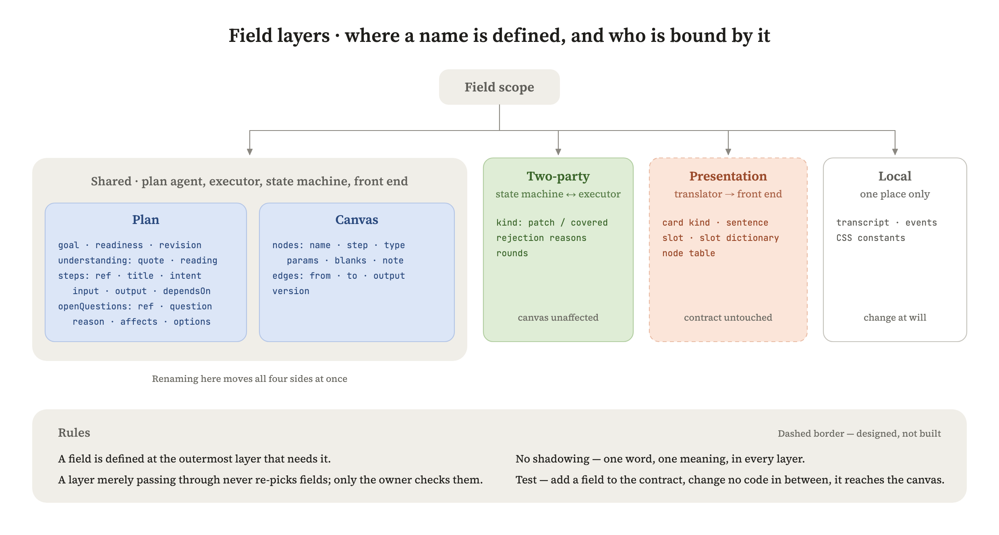

# 词表

我们说话用中文，代码里用英文。这张表是两边的对照，新加词要往这里补。

## 字段住在哪一层

同一个东西，不能在设计者那儿一个名、状态机里一个名、执行者那儿又一个名。分层是为了两件事：叫法统一，以及**以后加一格、删一格，只用改一处**。

照 Python 找名字那套（LEGB）借了两条：

1. **一个字段，定义在所有需要它的人共同的最外层**，不在里面各存一份。
2. **不许遮蔽。** Python 允许局部变量盖住全局的，我们这儿不行——同一个词在不同层不能指两样东西。执行者曾经把交上来的 `name` 改叫 `id` 存进画布，那就是一次遮蔽，已经删掉。

| 层 | 谁碰它 | 改它的代价 |
|---|---|---|
| 通用层 | 设计者、执行者、状态机、前端，四方都碰。方案的词和画布的词都在这层 | 最贵，改一个名字四处全动，所以这层定死 |
| 两方层 | 只在状态机和执行者之间走，用户看不见（`kind`、闸门退回的原因、轮次） | 中。不影响画布 |
| 展示层 | 翻译层产出，只有前端吃，上游不认识 | 低。契约不动，模型不知道 |
| 自己层 | 一个地方自己用（执行者的对话记录、前端的尺寸常数） | 随便改 |

配套一条规矩：**路过的层不许挑格子。** 中间的层要么整份带过去，要么只补自己拥有的那一格——执行者只补 `step`，别的原样过。一格一格重抄的写法看着老实，实际是：契约上新加的格子走到这儿就没了，`note` 就这么死过一次。**只有拥有这一层的地方才逐格检查**，闸门只查画布上那几样。

验收就一句：**契约上加一格，中间一行代码不用改，它自己走到画布。** 这条钉在 `test/executor/executor.test.mjs`。

## 一份方案里的东西

| 我们怎么说 | 代码里 | 是什么 |
|---|---|---|
| 一份方案 | `PlanProposal` | 模型每次产出的那份完整设计，整份重出，不是上一份的改动 |
| 能不能跑 | `readiness` | 这条链当前的可用程度 |
| 能交给执行 | `ready` | 该问的都问清了，可以交给执行。不打包票跑得通，跑不跑得通由执行裁决 |
| 只有骨架 | `partial` | 形状对了，参数还得用户自己填 |
| 目标 | `goal` | 一句话的端到端意图 |
| 回读 | `understanding` | 把用户的话读成了什么，给他核对用 |
| 原话 | `quote` | 从用户描述里原样摘出的片段，不改写 |
| 读成什么 | `reading` | 这段原话被理解成了什么 |
| 环节 / 步 | `steps` | 链路上的每一段，数据形态转变一次是一步 |
| 环节名 | `title` | |
| 这环要什么结果 | `intent` | 不写用什么工具、怎么实现 |
| 进来的形态 | `input` | 数据进这一环时处于什么形态 |
| 出去的形态 | `output` | 数据离开这一环时变成什么形态，下一环从这儿接 |
| 接在谁后面 | `dependsOn` | |
| 缺口 | `openQuestions` | 用户没说、而这条链需要的信息 |
| 缺了会怎样 | `reason` | 缺这条信息，链路哪里说不清 |
| 影响到哪几步 | `affects` | 只指向环节，不指向回读 |
| 备选项 | `options` | 模型知道答案有哪几种可能时列出来，用户可选可写；答案只在用户那边的不列 |
| 编号 | `ref` | `u1` `s1` `q1`，用户指着说"这条不对"的坐标 |
| 版本号 | `planRevision` | 整份方案的版本，系统分配 |

## 机制里的东西

| 我们怎么说 | 代码里 / 文档里 | 是什么 |
|---|---|---|
| 提交方案 | `propose_plan` | 模型可以调用的那个动作。一轮里有话就先说，再提交一份方案；判不出链路就不调用，只说话 |
| 不许自己加格子 | `additionalProperties: false` | JSON Schema 的写法：只能填我们印好的格子 |
| 严格模式 | `strict: true` | 个别厂商提供的生成端强制。跨厂商支持参差，我们不依赖它，强制归闸门。**这条路我们没走** |
| 通用插座 | `chat/completions` | 行业公共接口形状，几乎所有模型都说这口话。换模型只换地址、key、模型名三个配置 |
| 只准吐表格 | `output_config.format` | Claude API 参数，逼模型整轮只输出一份 JSON，一个多余的字都说不了。**这条路我们没走** |
| 一轮 / 回合制 | `say` / `stop` | 用户发一句是一轮，模型跑完回到用户。一轮在跑不收第二句，要插话先停 |
| 版本 | `revision` | 过了闸门的方案的序号，只在过闸时加一 |
| 分节标签 | XML tags | 提示词里用一对尖括号把每一节包起来，如 `<角色>…</角色>`。只标结构，不带排版，所以不会把标题、加粗的写法传染给模型说的话 |
| 桌上的五样 | per-step context | 状态机每一步临时组装给执行者的东西：整份方案、现在做哪一步、画布上已有什么（含前序节点实际输出）、挂在这一步上没答的问题、挂在这一步上的批注 |
| 画布改动 | patch | 执行者一步交回的东西：加或换哪些节点、怎么连、哪几格留空。过画布闸门才提交 |
| 批注 | 挂在步骤上的用户指示 | 跑完之后用户对着节点说的话。挂在步骤编号上不挂在节点上，节点重建它还在，执行者每步开工时读到 |
| 重走 / 已经有了 | reconcile / covered | 按开始从 s1 逐步过一遍；每步执行者看画布判断：已经有了就跳过，批了的或上游变了的重做 |
| 换手 | turn | 轮到谁动,从一方换到另一方那一下。你回车,换到模型;模型印出方案,换回你。跟下棋一样,我想的时候你不碰棋子 |
| 走步 | `start()` 里的循环 | 按开始以后,状态机把方案里的步骤一波一波做。做一步 = 拼上下文交给执行者、收回它交的、记一笔 |
| 一波 | `stepWaves` / topological levels | 互不依赖的步算同一波,一起交给执行者,一波做完才开下一波。同一波的步看到的都是这波开始前的画布——它们本来就互不依赖,看不见对方是对的。复杂的工作流不是一条直线,并行从这儿来 |
| 拼上下文 | `assembleTable` | 每做一步,把方案、这一步、画布现在有哪些节点、这步的问题、这步的批注拼在一起给模型。就是"桌上的五样",不玄 |
| 收场 | `outcome` | 一步做到最后是哪种结果:做完了、已经有了、被停了、查不过、出错 |
| 账本 | 会话手里攥着的 | 对话记录、方案、画布、批注、轮到谁。状态机就是攥着这几样的那个会话 |
| 一次走步的记录 | `run` | 按了哪版方案、每步的收场和当时的画布版本、怎么结束的、整张画布查出来的问题 |
| 平台目录 | `fixtures/n8n/catalog.json` | 从 n8n 官方镜像导出、精简过的全部节点说明。执行者"查平台"查的就是它 |
| 常驻 / 搜索 / 详情 | `summarize` / `search_nodes` / `describe_node` | 目录的三层披露:提示词里常驻十来行;模型给关键词回候选;模型点名才给参数,分操作的先给菜单 |
| 卡片 | canvas node | 画布上的一个节点，用户看到的那张。参数、空格都在上面 |
| 常驻节点 | resident nodes | 提示词里常驻的十三行，手写，每行说它做什么、什么时候用；参数还是查了才给 |
| 交 | `submit_step` | 执行者交回一步的动作：这一步全部的节点和线，或"已经有了"。契约在 contracts/step-submission.schema.json |
| 教形状的例子 | few-shot example | 提示词里一个真实交回的样子，边上写明它教的是格式不是答案 |

## 画布上的东西

通用层。执行者交、状态机保管、前端显示，四方用的是同一套词。

| 我们怎么说 | 代码里 | 是什么 |
|---|---|---|
| 节点的名字 | `name` | 这个节点在画布上的身份，也是连线两头写的东西，也是用户在卡上看到的标题。全线只有这一个词，不换成 `id` |
| 属于哪一步 | `step` | 这个节点归方案里哪一步（`s1`）。模型不交，执行者按当前这步补上；重做一步时靠它认领旧节点 |
| 节点类型 | `type` | 平台上的类型全名，如 `n8n-nodes-base.readWriteFile`。查目录得来，前端按它去找这张卡的话怎么说 |
| 参数 | `params` | 按平台的参数名填的那些值。这一格里面的形状是平台的，我们不定义，也不检查 |
| 空位 | `blanks` | 这一步没定、要用户来定的参数名，外加要接的凭证名。只在用户那边的信息（目录、表名、字段清单、凭证），执行者不编。平台有默认值、不填也能跑的不算 |
| 旁白 | `note` | 执行者写给用户的一句话：为什么是这个节点、这个形状，留空的地方它是怎么想的。不进平台的 json，只上卡。不写也能跑，所以闸门不查 |
| 线 | `edges` | `from` / `to` 写节点的名字 |
| 出口 | `output` | 多出口节点的线上写走哪个口：If 的 true/false、Loop Over Items 的 done/loop。单出口不写。同一对节点之间走不同出口是两条线，不是重复 |
| 画布版本 | `version` | 每提交一步加一 |

## 卡片上的东西（节点表有了第一行，翻译层还没做）

展示层。翻译层产出，只有前端吃；执行者和状态机都不认识这些词，所以加删不动契约。

| 我们怎么说 | 是什么 |
|---|---|
| 翻译层 | 把画布上一个节点翻成卡片能吃的东西。查两张表：格子词典和节点表 |
| 格子 | 卡上一个已定或没定的值。按"人怎么给它"分八种：接数据源 `source`、接连接 `credential`、挑一个 `pick`、填个数 `number`、正文 `body`（AI 写的 prompt、代码、SQL，成块显示）、给条件 `conditions`、真打字 `text`、上传一份 `upload`（JSON Schema 这类文件）。第八种是 LLM 卡的 Output Schema 逼出来的 |
| 格子词典 | 每种格子怎么显示、没定的时候怎么补上、点了出什么。写一次，全项目复用 |
| 节点表 | `nodes/*.json`，一个节点一个文件：卡类型、格子表（每格：卡上的名、八种的哪一种、能挑的值和默认值、没定时的入口）、进来什么、出去什么；外加类型标识和给执行者挑节点的一句话。契约 `contracts/node-definition.schema.json`。那句话的模板不要了，卡不拼句子 |
| 正文 | 有的节点一格就是一大段（LLM 的 Prompt、Code 的代码、Postgres 的 SQL），成块显示，AI 写的 |

## 角色

| 我们怎么说 | 文档里 | 是什么 |
|---|---|---|
| 设计者 | Plan Agent | 定这条链应该完成什么、怎样才算完整 |
| 执行者 | Execution Agent | 决定具体用什么、怎么做出来 |
| 调度 | 状态机 | 决定当前执行哪一步、什么时候暂停、什么时候问用户 |
| 闸门 | Gate | 测试与验收 |

## 砍掉的词

| 曾经用过 | 为什么砍 |
|---|---|
| `blocked` | 骨架都拼不出来的时候，模型根本不出画布、只跟用户说话。这个取值永远轮不上 |
| `constraints` | 平铺的字符串、没有出处、界面上没有落点 |
| `nodeCount` / `workItem` | 设计者不该指定这些，属于执行者的技术决策 |
| 那句人话 / 那句话的模板 | 卡不拼句子了：格子一行一行印，正文成块印。LLM 这张卡定下来的 |
